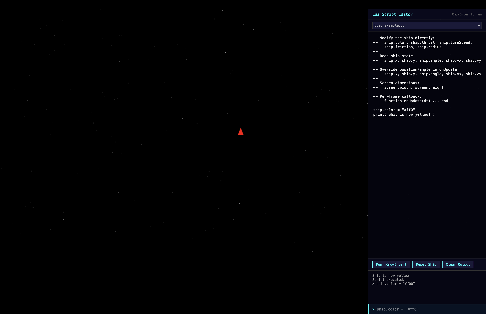

# Spacewar

A 2D spaceship game built with HTML5 Canvas, featuring an embedded Lua scripting engine (via [Fengari](https://fengari.io/)) for real-time game modification.



## Getting Started

### Prerequisites

- [Node.js](https://nodejs.org/) (v18+)

### Install & Run

```bash
npm install
npm run dev
```

Open http://localhost:8080 in your browser.

## Controls

### Player 1

| Key | Action |
|---|---|
| WASD | Rotate and thrust |
| Space | Shoot |

### Player 2

| Key | Action |
|---|---|
| Arrow keys | Rotate and thrust |
| `/` (slash) | Shoot |

### General

| Key | Action |
|---|---|
| `` ` `` (backtick) | Toggle script editor |
| Escape | Close script editor |
| Ctrl/Cmd+Enter | Run full script |
| Ctrl/Cmd+Up / Ctrl/Cmd+Down | Switch focus: script editor / REPL |
| Ctrl/Cmd+Left / Ctrl/Cmd+Right | Switch focus: game / editor panel |

## Lua Scripting

Press backtick to open the editor. A single-line REPL is at the bottom for quick commands; the textarea above is for multi-line scripts.

### API

Type `help()` in the REPL for the full reference. Summary:

| Global | Description |
|---|---|
| `ship` / `ship1` | Player 1's ship (alias for ship1) |
| `ship2` – `ship4` | Other players' ships (nil if not present) |
| `ship.color` | Ship color (CSS color string) |
| `ship.thrust` | Acceleration per frame (default 0.15) |
| `ship.turnSpeed` | Rotation per frame (default 0.05) |
| `ship.friction` | Velocity decay 0-1 (default 0.995) |
| `ship.radius` | Ship size (default 20) |
| `ship.fireCooldown` | Seconds between shots (default 0.25) |
| `ship.showName` | Show name above ship (default false) |
| `ship.controlScheme` | 0=WASD, 1=arrows (default 0) |
| `ship.explosionParticles` | Particle count on death (default 25) |
| `ship.x`, `ship.y` | Position (read/write) |
| `ship.angle` | Facing angle in radians |
| `ship.vx`, `ship.vy` | Velocity (read/write) |
| `ship.destroyed` | Whether the ship is currently destroyed |
| `screen.width`, `screen.height` | World dimensions (1920×1080) |
| `projectiles` | Array of active projectiles |
| `shoot()` | Fire a projectile from your ship |
| `print(...)` | Output to the editor console |
| `help()` | Print full API reference |
| `function onUpdate(dt) ... end` | Per-frame callback (dt in seconds) |

### Examples

```lua
-- Change color
ship.color = "#ff0"

-- Rainbow cycling
local t = 0
function onUpdate(dt)
  t = t + dt * 2
  local r = math.floor(math.sin(t) * 127 + 128)
  local g = math.floor(math.sin(t + 2.094) * 127 + 128)
  local b = math.floor(math.sin(t + 4.189) * 127 + 128)
  ship.color = string.format("#%02x%02x%02x", r, g, b)
end
```

## Development

### Project Structure

```
src/
  main.js              Entry point, wires modules together
  ship.js              Ship physics (pure logic, no DOM)
  input.js             Keyboard state manager
  stars.js             Starfield generation and rendering
  projectiles.js       Projectile spawning, movement, and rendering
  explosions.js        Particle explosion effects
  collision.js         Collision detection
  world.js             World dimensions, player colors, spawn positions
  lua-integration.js   Fengari/Lua bridge
  editor.js            Script editor panel UI
  leaderboard.js       Score tracking and display
  net.js               WebSocket client and interpolation
  storage.js           localStorage persistence layer
server/
  index.js             Multiplayer WebSocket server
tests/
  ship.test.js             Ship physics unit tests
  projectiles.test.js      Projectile system unit tests
  explosions.test.js       Explosion particle unit tests
  collision.test.js        Collision detection unit tests
  world.test.js            World constants unit tests
  leaderboard.test.js      Leaderboard scoring unit tests
  interpolation.test.js    Network interpolation unit tests
  lua-integration.test.js  Lua bridge integration tests
  input.test.js            Input manager unit tests
  stars.test.js            Starfield unit tests
  storage.test.js          Storage persistence unit tests
  editor.test.js           Editor storage integration tests
```

### Scripts

```bash
npm run dev          # Local dev server (2-player local mode)
npm run serve        # Multiplayer server (LAN)
npm run serve:tunnel # Multiplayer server + public URL for remote play
npm run lint         # Run ESLint
npm test             # Run tests (Vitest)
npm run test:watch   # Run tests in watch mode
```

### Architecture

- **No build step** -- the game runs as plain ES modules served over HTTP
- **Fengari** is loaded from CDN in the browser; the npm `fengari`/`fengari-interop` packages are dev dependencies for testing only
- All modules use **dependency injection** for testability (fengari, canvas, DOM elements are passed as parameters)

## License

MIT
